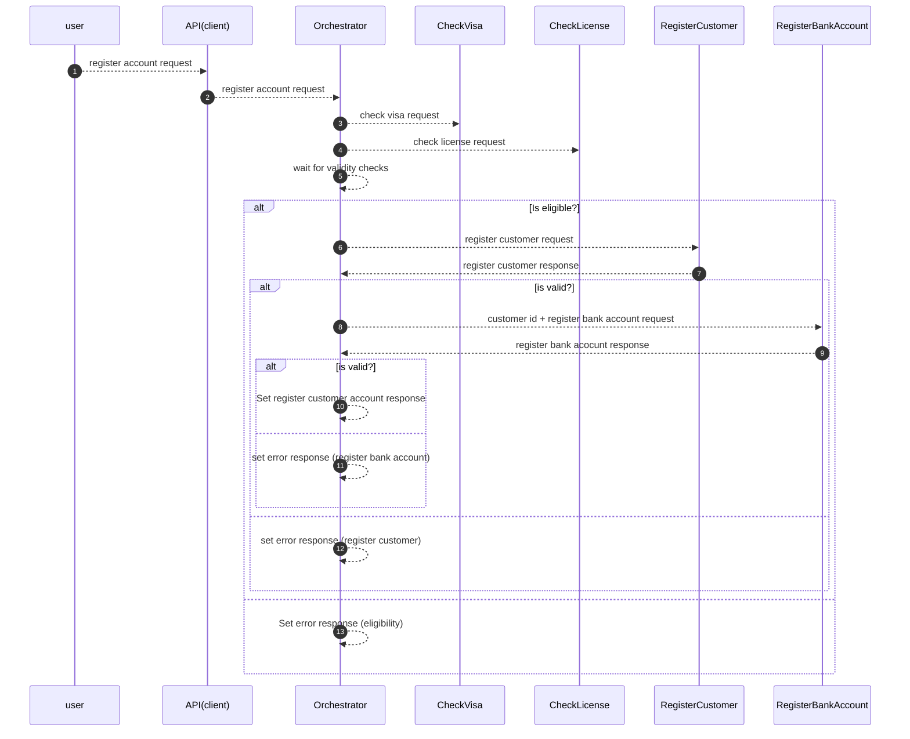
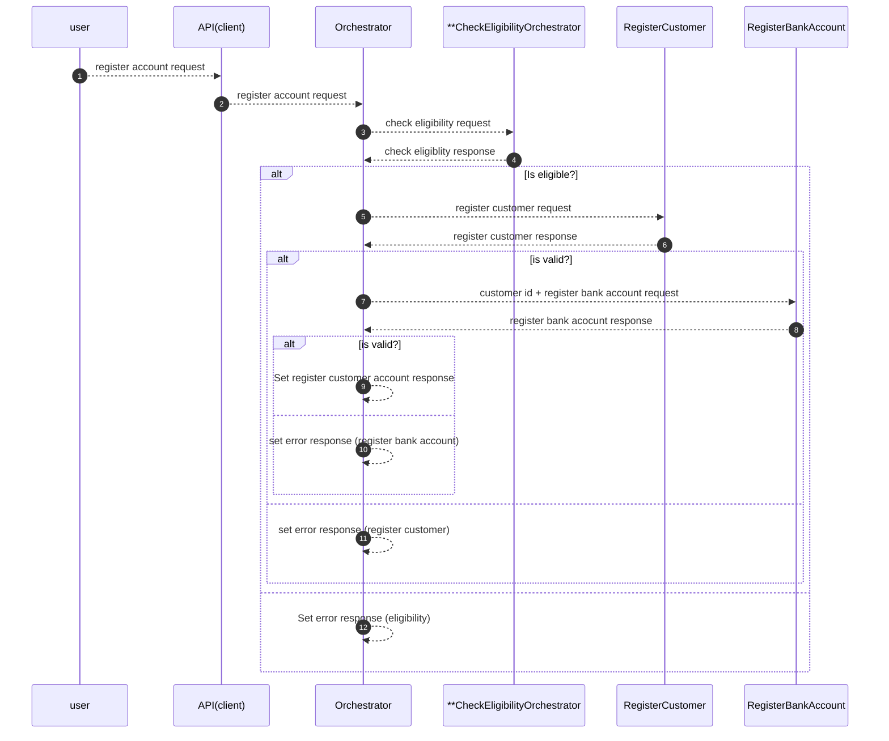

## Function chaining, fan-in and fan out with durable functions

### Function chaining

---

### Fan-out/fan-in

---

### Example 01 (Without sub-orchestrators)

```mermaid
sequenceDiagram
autoNumber

user -->> API(client): register account request
API(client) -->> Orchestrator: register account request
Orchestrator -->> CheckVisa: check visa request
Orchestrator -->> CheckLicense: check license request
Orchestrator -->> Orchestrator: wait for validity checks
alt Is eligible?
    Orchestrator -->> RegisterCustomer: register customer request
    RegisterCustomer -->> Orchestrator: register customer response
    alt is valid?
        Orchestrator -->> RegisterBankAccount: customer id + register bank account request
        RegisterBankAccount -->> Orchestrator: register bank acocunt response
        alt is valid?
            Orchestrator -->> Orchestrator: Set register customer account response
        else
            Orchestrator -->> Orchestrator: set error response (register bank account)
        end
    else
        Orchestrator -->> Orchestrator: set error response (register customer)
    end
else
    Orchestrator -->> Orchestrator: Set error response (eligibility)    
end
```

### Example 02

```mermaid
sequenceDiagram
autoNumber

user -->> API(client): register account request
API(client) -->> Orchestrator: register account request
Orchestrator -->> **CheckEligibilityOrchestrator: check eligibility request
**CheckEligibilityOrchestrator -->> Orchestrator: check eligiblity response
alt Is eligible?
    Orchestrator -->> RegisterCustomer: register customer request
    RegisterCustomer -->> Orchestrator: register customer response
    alt is valid?
        Orchestrator -->> RegisterBankAccount: customer id + register bank account request
        RegisterBankAccount -->> Orchestrator: register bank acocunt response
        alt is valid?
            Orchestrator -->> Orchestrator: Set register customer account response
        else
            Orchestrator -->> Orchestrator: set error response (register bank account)
        end
    else
        Orchestrator -->> Orchestrator: set error response (register customer)
    end
else
    Orchestrator -->> Orchestrator: Set error response (eligibility)    
end
```
