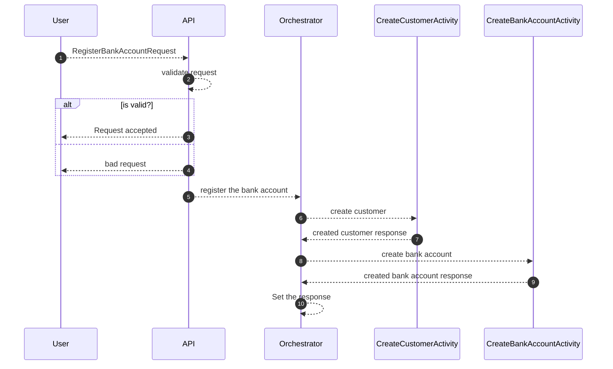
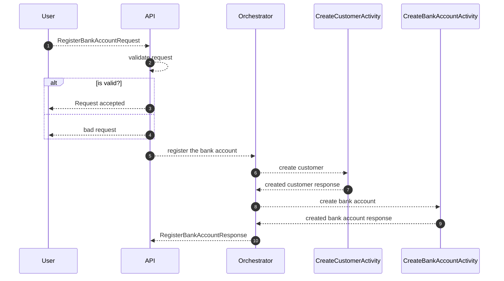

## Azure Durable Functions

- Prerequisites
  - [x] Install `Microsoft.Azure.WebJobs.Extensions.DurableTask.Analyzers`
  

- Prerequisites for Rider  
  - [x] Install `Azure Toolkit for Rider` extension

- Prerequisites for VS Code
  - [x] MENTION THE EXTENSIONS

## Azure durable function patterns

### Function chaining
* Asynchronously calling HTTP endpoint

* Synchronously calling HTTP endpoint

## Azure durable function concepts

## Azure durable function runtime status

https://docs.microsoft.com/en-us/javascript/api/durable-functions/orchestrationruntimestatus?view=azure-node-latest

## Comparing Azure Durable Functions

https://docs.microsoft.com/en-us/azure/azure-functions/functions-compare-logic-apps-ms-flow-webjobs#compare-azure-functions-and-azure-logic-apps

  
### References
- [x] Azure durable functions overview
  
https://docs.microsoft.com/en-us/azure/azure-functions/durable/durable-functions-overview?tabs=csharp

- [x] Azure durable functions concepts

https://docs.microsoft.com/en-us/azure/azure-functions/durable/durable-functions-types-features-overview

- [x] Durable functions HTTP API reference

https://docs.microsoft.com/en-us/azure/azure-functions/durable/durable-functions-http-api

- [x] Azure functions best practices

https://docs.microsoft.com/en-us/azure/azure-functions/functions-best-practices

  